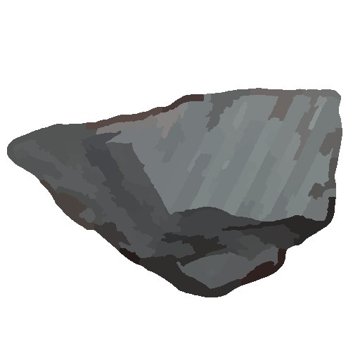

<h1 align="center">Slate Engine</h1>

<p align="center">
  
</p>


[](https://github.com/breadcat-dev/slate-engine)
[](https://github.com/breadcat-dev/slate-engine)
[](https://github.com/breadcat-dev/slate-engine)

---

## Installation

### Requirements

- Java JDK 21+
- Gradle 9.3.0+ (included)
- Git

Currently, Slate Engine is not on Maven Central.
To use it, clone the repository and publish it to your local Maven repository.

### Linux / MacOS

```sh
git clone https://github.com/breadcat-dev/slate-engine.git
cd slate-engine
./gradlew publishToMavenLocal
```

### Windows

```sh
git clone https://github.com/breadcat-dev/slate-engine.git
cd slate-engine
./gradlew.bat publishToMavenLocal
```

Once installed, add the dependency:

### Groovy
```gradle
implementation "cat.breadcat.slate:engine:<version>"
```

### Kotlin
```gradle
implementation("cat.breadcat.slate:engine:<version>")
```

---

## Roadmap

- Transform
- Renderable

## Dependencies

- Slate Engine - Math - [Github](https://github.com/breadcat-dev/slate-math)

## License

PolyForm Noncommercial License 1.0.0
